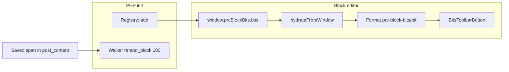

# PRC Block Bits (`@prc/block-bits`)

Inline RichText **bits**: small dynamic tokens inside paragraph/heading text (not whole-block bindings). This plugin owns the **registry**, **render walker**, **editor format type**, and **toolbar picker**.

Human-oriented API reference: [README.md](README.md).

## When to use bits


| Use **bits**                                                  | Use **block bindings**        |
| ------------------------------------------------------------- | ----------------------------- |
| Dynamic fragment **inside** static copy (`…the <bit> group…`) | Entire block field is dynamic |
| Mid-paragraph / mid-heading                                   | Block-level replacement       |


## Architecture (one minute)




1. **PHP** — Consumer plugins call `register_block_bit()` on `init` (priority `11` is typical). `Assets` projects an allowlisted payload onto `window.prcBlockBits.bits` before the editor script runs.
2. **Editor boot** — `src/editor/index.ts`: `hydrateFromWindow()` → built-in `registerBlockBit()` overlays → `registerBitFormatType()` (single shared rich-text format).
3. **Insert** — Toolbar uses `insertObject()` (not `object: true` on the format). Saved markup:
  ```html
   <span class="prc-block-bit" data-prc-block-bit="my-plugin/my-bit" data-…="…">fallback text</span>
  ```
4. **Frontend** — `Walker` (`includes/class-walker.php`) runs at `render_block` priority `100`, early-exits unless content contains `prc-block-bit`, then dispatches **iapi** or **callback** per bit.

There is **no** `@wordpress/data` store for bits — a module-level `Map` in `src/editor/registry/registry.ts` is intentional (static, read-mostly).

## Adding a third-party bit (checklist)

### 1. PHP registration (required)

Guard and register on `init`:

```php
if ( ! function_exists( '\PRC\Platform\Block_Bits\register_block_bit' ) ) {
    return;
}

\PRC\Platform\Block_Bits\register_block_bit(
    'my-plugin/my-bit-slug',
    array(
        'label'               => __( 'My Bit', 'my-plugin' ),
        'category'            => 'Quiz', // optional; groups bits in modal picker
        'allowed_block_types' => array( 'core/paragraph', 'core/heading' ), // [] = all RichText blocks
        'default_text'        => __( 'fallback', 'my-plugin' ), // MUST be request-deterministic (VIP cache)
        'render_strategy'     => 'iapi', // or 'callback'
        // iapi: namespace, text, bind, tag_name, …
        // callback: render_callback => fn( $attrs, $parsed_block, $block ): string
        'attributes'          => array(
            'myAttr' => array( 'type' => 'string', 'default' => '' ),
        ),
    )
);
```

**Rules**

- Name: `<namespace>/<bit-kebab>` (lowercase, dashes). First registration wins; duplicates `_doing_it_wrong`.
- `default_text`: same for every request to a URL — no per-user or time-varying values (edge cache).
- Attribute `type`: `string` | `int` | `hex_color` | `icon_name` | `enum` (see `Registry` in PHP).

**Examples in-repo**


| Plugin                | File                                                               |
| --------------------- | ------------------------------------------------------------------ |
| iAPI / state-driven   | `plugins/prc-quiz-political-typology-2026/src/results/results.php` |
| Callback / attributes | `plugins/prc-block-bits/includes/bits/class-icon-span.php`         |


### 2. Editor overlay (recommended)

PHP projects `label`, `title` (same as label), `category`, `allowedBlockTypes`, `attributes`, `defaultText`. JS overlays add **icon**, **title** override, and optional `**edit`** picker.

```ts
import { registerBlockBit } from '@prc/block-bits';

registerBlockBit( 'my-plugin/my-bit-slug', {
    title: __( 'My Bit', 'my-plugin' ),
    icon: someDashicon,
    edit: MyBitEdit, // only if authors pick attributes before insert
} );
```

**Load the overlay** from an editor script that runs where authors insert bits (e.g. your block's `index.js`). If the overlay never runs, the bit still works using PHP `label` as the menu title (default icon: `postContent`).

**Monorepo webpack** — If your bundle imports `@prc/block-bits`, use the **repo root** `webpack.config.js` (see `plugins/prc-quiz-political-typology-2026/webpack.config.js`). Add `"@prc/block-bits": "*"` to `package.json` dependencies. The import externalizes to `window.prcBlockBitsEditor` / handle `prc-block-bits-editor`.

### 3. Attribute-bearing bits (`edit` component)

Implement `BitEditProps` (`onCommit` / `onCancel`). Pattern: `src/editor/builtins/icon-span/edit.tsx`.

- Use local `useState` only for **transient** picker UI, not for mirroring committed attributes (RTC-safe).
- `onCommit({ attributes, innerHTML? })` — toolbar runs `insertObject` with merged attrs.
- `innerHTML` must be non-empty for `contentEditable: false` formats at save time (see icon-span `%icon%` placeholder).

### 4. iAPI bits

Walker adds directives; editor-saved `default_text` is the fallback when the Interactivity store is absent. Bind to an existing store namespace (e.g. `prc-quiz/controller`). See PT-2026 registrations and `tests/prc-block-bits/pt-2026-bits.spec.ts`.

### 5. Tests & release

- E2E: `tests/prc-block-bits/` (Playwright, root `playwright.config.js`).
- PHPUnit/walker: test fixtures load when `PRC_PLATFORM_TESTING_MODE` is true (`tests/prc-block-bits/fixtures/test-bits.php`).
- Ship a **changeset** for `@prc/block-bits` if you change this plugin; ship changesets for **your** workspace when you only touch consumer PHP/JS.

## Editor picker UX


| Applicable bits | UI                                                 |
| --------------- | -------------------------------------------------- |
| ≤ 5             | Inline `Popover` + single menu group               |
| > 5             | `BitsPickerModal` — category `MenuGroup`s + search |


- Uncategorized bits → **General** (`UNCATEGORIZED_LABEL` in `registry.ts`).
- Modal search: `filterBitGroups()` matches title, label, slug, and category name.
- Cursor on existing bit → `BitPopover` (Edit / Remove), not the insert picker.

## Working on this plugin


| Path                          | Purpose                                          |
| ----------------------------- | ------------------------------------------------ |
| `includes/class-registry.php` | PHP validation & storage                         |
| `includes/class-walker.php`   | Frontend render dispatch                         |
| `includes/class-assets.php`   | Editor script + `window.prcBlockBits` projection |
| `includes/bits/`              | Built-in bit PHP classes                         |
| `src/editor/registry/`        | TS registry, `hydrateFromWindow`, grouping       |
| `src/editor/format-type.ts`   | Shared `prc-block-bits/bit` format               |
| `src/editor/toolbar/`         | Toolbar button, modal, popover, search filter    |
| `src/editor/builtins/`        | icon-span, copyright, shareable-text             |
| `src/settings/`               | Admin settings (disable bits per site)           |
| `build/editor/`               | Built editor bundle (`prc-block-bits-editor`)    |


**Build** (from repo root):

```bash
npx turbo build --filter=@prc/block-bits
npm run start -w @prc/block-bits   # watch editor + settings
```

Requires `prc-scripts` active (`Requires Plugins` in main plugin file).

## Agent gotchas

1. **Bits ≠ block bindings** — inline RichText only; do not use for whole-block dynamic fields.
2. `**default_text` and VIP cache** — must not vary by user, role, or clock; callable `default_text` is rejected.
3. **Format type** — one format for all bits; per-bit data lives in `data-prc-block-bit` + `data-`* attrs. Do not set `object: true` on the format (breaks save HTML); use `insertObject` in the toolbar.
4. **Init order** — `hydrateFromWindow()` before `registerBitFormatType()`; built-in overlays between them (`src/editor/index.ts`).
5. **Disabled bits** — Settings can remove a bit from the projected payload; `registerBlockBit()` in JS is a no-op if the name is missing from `window.prcBlockBits.bits`.
6. **Modal categories** — set `category` in PHP (e.g. `'Quiz'` for quiz plugins); affects grouping and search, not render behavior.
7. **Visual bits** — add a `prc-block-bit-<name>` reset in `src/style/editor.scss` if the default token pill is wrong (see icon-span).
8. **Do not** add per-plugin Playwright configs or `.wp-env.json` — tests live in `/tests/prc-block-bits/`.

## Related docs

- [README.md](README.md) — full `register_block_bit()` schema and strategies
- [docs/DEVELOPMENT_GUIDELINES.md](../../docs/DEVELOPMENT_GUIDELINES.md) — platform block patterns
- Root [AGENTS.md](../../AGENTS.md) — monorepo commands, Playground, Turbo builds

